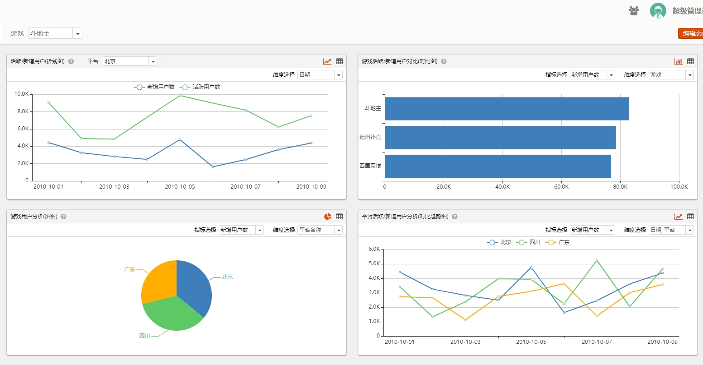

# 项目概述
Seed自助数据展示系统只是一款简易的BI系统，它方便快捷，可以通过简易的拖拽并配置报表，使只会SQL的统计人员都能快速搭建出属于自己的数据可视化报表。
<div align="center">


</div>


## 测试网址
http://seed.boyaa.com

测试账号: admin 密码: admin123

## 系统操作手册
[如何操作Seed自助数据展示系统](docs/README.md)

## 如何安装
1. 需要环境
    ```
    系统环境: Linux, Mac和Windows
    运行环境: Python3.5+
    其他软件: Redis, MySQL(Postgresql)

    注: 数据库一定要使用空库。
    ```
2. 安装
- pip安装
    ```
    pip install boyaa-seed
    ```

- 编译安装
    ```
    获取代码 git clone git@github.com:BoyaaDataCenter/seed.git
    进入文件夹 cd seed
    编译代码 python setup.py install
    ```
3. 初始化seed的config文件
    ```
    执行seed init
    ```
4. config文件设置
    ```
    打开用户根目录下的.seed/seed_conf.py文件
    进行数据库等相关的配置
    如: vim ~/.seed/seed_conf.py
    ```
5. 初始化数据库
    ```
    进行数据库初始化, 执行
    seed upgrade
    即可
    ```
6. 运行web程序
    ```
    执行 seed run web运行web系统
    注:因uwsgi模块不支持Windows,故只能以开发模式运行:seed run web --debug=True
    ```
7. 访问
    ```
    127.0.0.1:5000 可访问系统
    ```

## 如何升级
1. 获取到最新代码
2. 打包seed
    ```
    进入seed项目根目录
    运行 python setup.py install
    ```
3. 运行web程序
    ```
    执行 seed run web运行web系统
    ```
4. 访问
    ```
    127.0.0.1:5000 可访问系统
    ```

## 开发模式
1. 安装seed的pip运行文件到第三方库中
    ```
    python setup.py develop
    ```
2. 运行seed数据
    ```
    seed init
    ```
3. 设置数据库
    ```
    vim ~/.seed/seed_config.py
    ```
4. 运行web
    ```
    seed run web --debug=True
    ```


## 图形说明

###1、桑基图使用规范  
桑基图源数据需可以将数据按照以下形式组合:  
selet source, target ,value  from table  
union all  
selet source, target ,value from table  
(上面一条sql的target需要和下一条sql的source相同,否则就不能形成桑基图形式  
source, target 这两个字段别名已固定)  


#####数据示例说明(以mysql为例):  

CREATE TABLE `sankey_testdata` (  
  `state` varchar(20) ,  
  `address` varchar(20) ,  
  `province` varchar(20) ,  
  `value` int  
) ENGINE=innodb  DEFAULT CHARSET=utf8;  

insert into sankey_testdata values  
('东部地区',  '东三省',  '黑龙江',246),  
('东部地区',  '东三省',  '吉林', 319),  
('东部地区',  '东三省',  '辽宁', 871),  
('东部地区',  '华南',     '广东', 323),  
('东部地区',  '华南',     '广西', 250),  
('东部地区',  '华南',     '海南', 431),  
('东部地区',  '华南',     '福建', 236),  
('东部地区',  '华南',     '香港', 334),  
('东部地区',  '华南',     '澳门', 544),  
('东部地区',  '华南',     '台湾', 915),  
('东部地区',  '环渤海',  '北京', 687),  
('东部地区',  '环渤海',  '天津', 340),  
('东部地区',  '环渤海',  '内蒙古',234),  
('东部地区',  '环渤海',  '河北', 282),  
('东部地区',  '环渤海',  '山东', 102),  
('东部地区',  '长三角',  '上海', 201),  
('东部地区',  '长三角',  '江苏', 717),  
('东部地区',  '长三角',  '浙江', 669),   
('西部地区',  '西北',     '青海', 335),   
('西部地区',  '西北',     '甘肃', 357),   
('西部地区',  '西北',     '宁夏', 456),   
('西部地区',  '西北',     '山西', 119),  
('西部地区',  '西北',     '新疆', 984),  
('西部地区',  '西南',     '云南', 611);  

#####桑基图查询SQL示例:  
SELECT  
  state as source,  
  address as target,  
  sum(value) as value  
FROM sankey_testdata   
GROUP BY state,address  
union all  
SELECT  
  address as source,  
  province as target ,  
  sum(value) as value  
FROM sankey_testdata  
GROUP BY address,province  


###2、地图使用规范   
地图源数据至少需要以下字段  
经度  
纬度  
区域名称  
区域id  
区域上级id  
区域级别id(此分类必须和以下一致,否则可能导致数据显示错乱)  
1-国家  
2-省份  
3-地市  
4-区县/乡镇(街道)  
7-社区  
8-具体位置  


#####数据示例说明(以mysql为例):  

CREATE TABLE `map_testdata` (  
  `fdate` date,  
  `fid` int comment '区域id',  
  `region_name` varchar(100) comment '区域名称',  
  `fpid` int comment '区域上级id',   
  `region_id` int comment '区域级别id',  
  `value1` int,  
  `value2` int,  
  `value3` int,  
  `lat` varchar(100) comment '经度',  
  `lng` varchar(100) comment '纬度'  
) ENGINE=innodb  DEFAULT CHARSET=utf8;  


insert into map_testdata values  
('2019-05-08',1,'中国',0,1,25000,10000,20000,'37.550339','104.114129'),  
('2019-05-08',107712,'广东省',1,2,5000,3000,1000,'23.408003729025','113.39481755876'),  
('2019-05-08',112083,'深圳市',107712,3,3000,1000,1500,'22.546053546205','114.02597365732'),  
('2019-05-08',112313,'南山区',112083,4,2000,300,200,'22.558887751083','113.95072266574'),  
('2019-05-08',null,null,'112313',7,2,2,2,'22.5557455','114.026432'),  
('2019-05-08',null,null,'112313',7,40,40,40,'22.5658103','114.0948389'),  
('2019-05-08',null,null,'112313',7,166,166,166,'22.53615273','114.1144042'),  
('2019-05-08',null,null,'112313',7,80,80,80,'22.5232017','114.0353637'),  
('2019-05-08',null,null,'112313',7,14,14,14,'22.53781229','114.1248561'),  
('2019-05-08',null,null,'112313',7,1,1,1,'22.578339','114.140053'),  
('2019-05-08',null,null,'112313',7,1,1,1,'22.52957','114.200043'),   
('2019-05-08',null,null,'112313',7,33,33,33,'22.60465685','114.1245172'),  
('2019-05-08',null,null,'112313',7,154,154,154,'22.5465231','114.0245698'),  
('2019-05-08',null,null,'112313',7,1,1,1,'22.530012','114.199852'),  
('2019-05-08',null,null,'112313',7,12,12,12,'22.6010765','113.8757611'),  
('2019-05-08',null,null,'112313',7,5,5,5,'22.5274626','114.195732'),  
('2019-05-08',null,null,'112313',7,3,3,3,'22.58916333','113.9847973'),  
('2019-05-08',null,null,'112313',7,2,2,2,'22.510313','114.146149'),  
('2019-05-08',null,null,'112313',7,52,52,52,'22.56592831','114.1653427'),  
('2019-05-08',null,null,'112313',7,6,6,6,'22.5230185','113.8840307'),  
('2019-05-08',null,null,'112313',7,8,8,8,'22.55479675','113.876808'),  
('2019-05-08',null,null,'112313',7,2,2,2,'22.527546','114.1382295'),  
('2019-05-08',null,null,'112313',7,20,20,20,'22.60403745','113.8813462'),  
('2019-05-08',null,null,'112313',7,3,3,3,'22.53090833','114.0340117'),  
('2019-05-08',null,null,'112313',7,24,24,24,'22.52259221','114.1844415'),  
('2019-05-08',null,null,'112313',7,6,6,6,'22.56845417','113.8482768'),  
('2019-05-08',null,null,'112313',7,15,15,15,'22.50921313','114.1460804'),  
('2019-05-08',null,null,'112313',7,1,1,1,'22.52459','113.873619'),  
('2019-05-08',null,null,'112313',7,54,54,54,'22.51644502','113.9074763'),  
('2019-05-08',null,null,'112313',7,110,120,135,'22.54528264','113.9450687');  


#####地图查询SQL示例:  
以下SQL中的{}表示变量,使用地图时  
region_id,slat,elat,slng,elng,fpid均为必须参数  

postgresql写法:  
SELECT  
   a.region_name,  
   a.fid as fpid,  
   a.lat,  
   a.lng,  
   a.value1,  
   a.value2,  
   a.value3   
from  map_testdata a  
WHERE region_id = {region_id}  
  AND cast(lat AS decimal(20, 10)) > {slat}  
  AND cast(lat AS decimal(20, 10))< {elat}  
  AND cast(lng AS decimal(20, 10)) > {slng}  
  AND cast(lng AS decimal(20, 10))< {elng}  
  AND CASE cast( {fpid} AS bool ) WHEN TRUE THEN fpid={fpid} ELSE 1=1 END  


mysql写法:  
SELECT  
   a.region_name,  
   a.fid as fpid,  
   a.lat,  
   a.lng,  
   a.value1,  
   a.value2,  
   a.value3  
from  map_testdata a  
WHERE region_id = {region_id}  
  AND cast(lat AS decimal(20, 10)) > {slat}  
  AND cast(lat AS decimal(20, 10))< {elat}   
  AND cast(lng AS decimal(20, 10)) > {slng}  
  AND cast(lng AS decimal(20, 10))< {elng}  
  AND CASE {fpid}=true WHEN TRUE THEN fpid={fpid} ELSE 1=1 END    