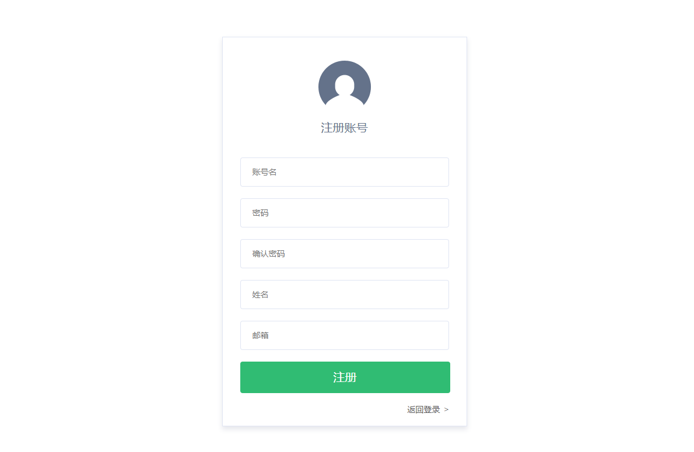
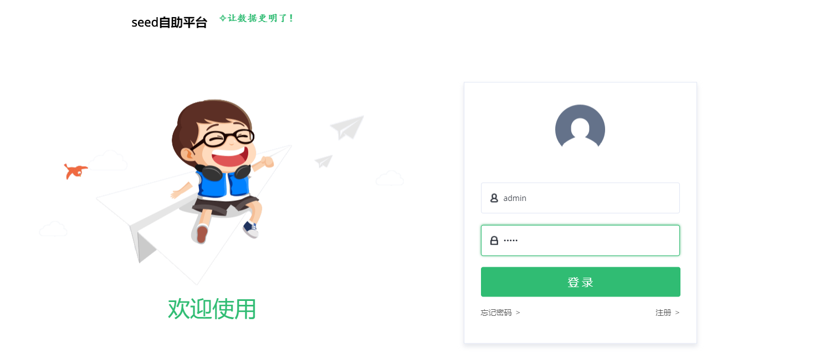
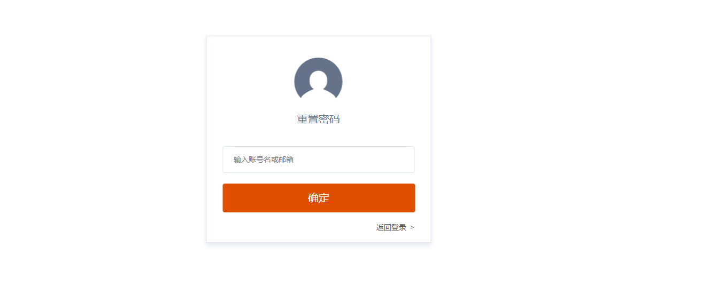

# 注册和登录用户
Seed系统目前只支持账户密码登录的方式，下面将介绍如何进行注册，登录 和 找回密码。

注册新系统的第一个用户既为超级管理员，超级管理员有所有的权限。之后的用户即为普通用户，超级管理员可以通过系统里面的设置来更改其他用户的权限。

## 注册
输入Seed系统对应的域名会进入登陆页面，可以通过登陆页面的下方进入注册页面。如下图所示。

注册内容和平时的网站一样，唯一需要值得注意的是，如果当前系统配置了可用的邮件服务配置，注册之后将会通过 邮件验证 来激活账户，才能正常的使用当前账户。

建议无论邮件服务配置是否开启，都建议使用自己有效可用的邮箱来注册。

## 登录
输入Seed系统对应的域名，在没有登陆的状态，将会直接跳转到登陆页面。登录页面入下图所示。

## 找回密码
**注意: 找回密码因为涉及到邮件发送，只有在邮件服务配置成功的时候才能使用**
如果用户忘记了密码，可以通过点击登录页面的忘记密码进入，密码找回页面。密码找回页面如下图所示

在输入账号或者邮箱之后, 系统会通过配置的邮件服务，发送找回密码的邮件给用户，让用户通过邮件中的链接输入新的密码即可。