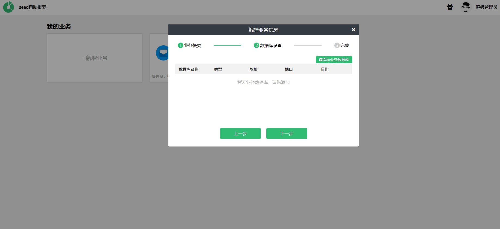

# 业务管理
Seed系统是通过业务将不同属性的报表区分开的。

每个游戏工作室的报表需求不一样，那么可以通过给每个游戏工作室分配不同的业务。将对应业务的权限交给对应工作室的负责做统计报表的工作人员，那么对应的工作人员就可以在自己工作室的业务下进行相关的业务报表配置。

## 新建和编辑业务
用户登录进入系统之后，就可以进入业务选择的页面。和普通用户不一样的是，超级管理员拥有对业务添加的权限，分配的业务管理员拥有对业务编辑的权限。
由于新建业务和编辑业务是同样的操作逻辑，这里将会一并介绍。

### 业务列表
业务列表 如下图所示

只有超级管理员才能看到新建业务, 超级管理员可以通过 点击 新建业务进入新建业务的业务逻辑。

超级管理员和业务管理员都可以通过点击某个业务右上方的配置按钮 对当前业务已有的配置进行编辑。

业务配置总共分三步，分别是业务概况，业务数据库配置和业务数据保存。

### 业务概况设置

由上图所示，业务概况需要配置业务名称，业务概要 和 选择当前业务的业务管理员。
业务名称和业务概要主要是用来介绍当前业务的主要属性。

业务管理员则是指定当前业务所有权限归谁使用，业务管理员可以指定多个人，因为超级管理员级别在业务管理员之上，在配置的时候，可以不用配置超级管理员为业务管理员。

### 业务数据库设置

接下来进入业务数据库配置，业务数据库主要是在配置报表和展示报表时的取数，如果当前业务的报表数据需要从PostgreSQL A中获取，则需要在这里配置PostgreSQL A的连接配置。

点击添加业务数据库，则可以进入业务数据库配置页面。如下图所示

需要提前选择配置数据库的类型，目前只支持MySQL和PostgreSQL两种常见的关系型数据库。然后就是常规的数据库连接配置了。可以在配置完之后，点一下测试连接。当测试连接成功之后，则可以点击保存。

新建业务数据库成功后，则返回了业务数据库列表。可以看出业务可以支持多个数据库的连接。

### 业务数据保存
在配置完业务数据库之后，点击下一步，将会将当前业务的所有配置展示在最后一步

点击完成，则添加了新的业务到业务列表中

## 删除业务
删除按钮则可以通过业务上方的删除按钮进行删除。

## 备注
暂无