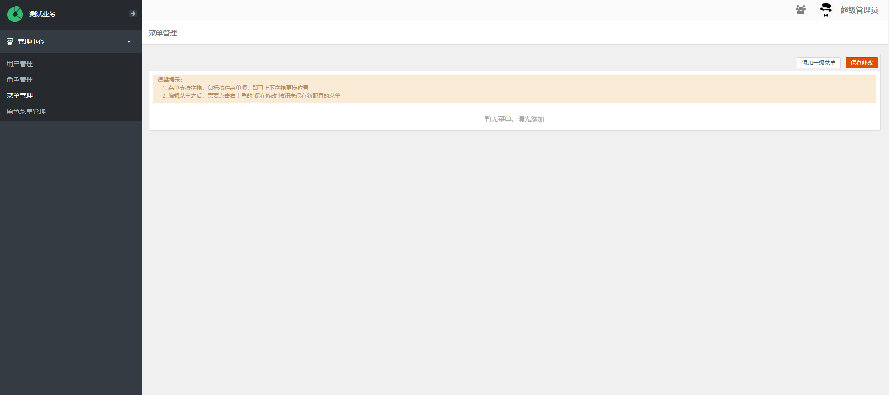
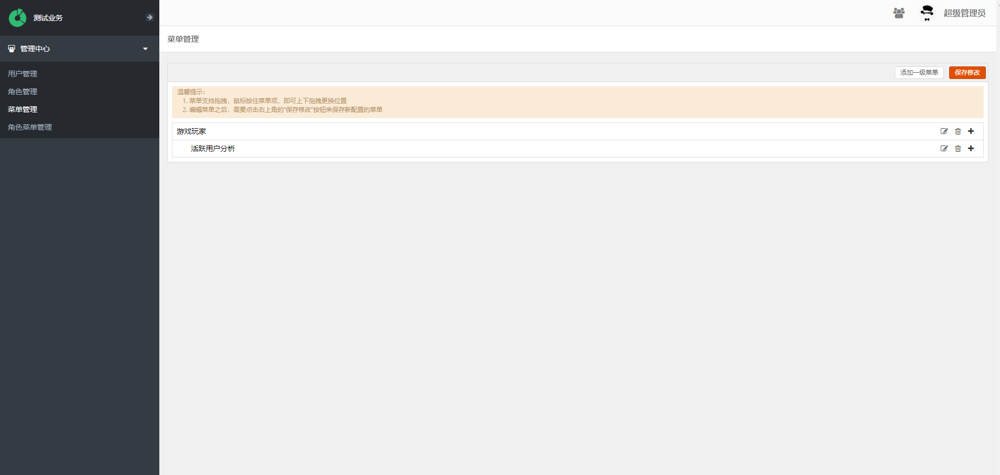
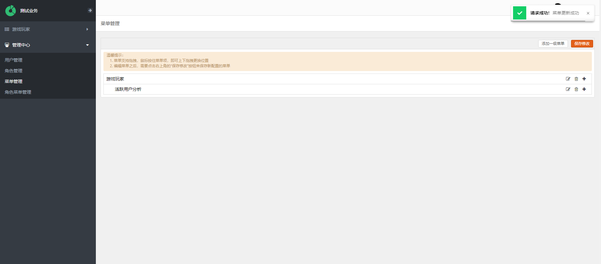
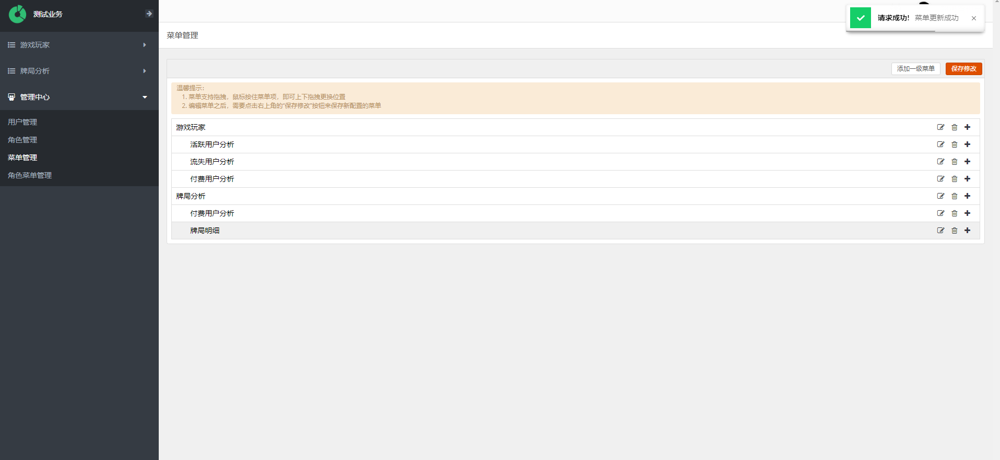
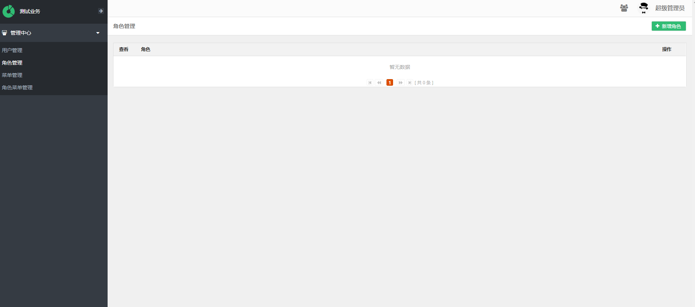
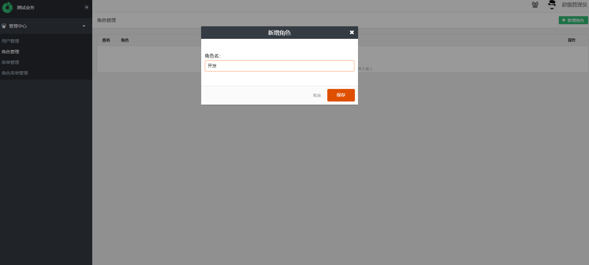
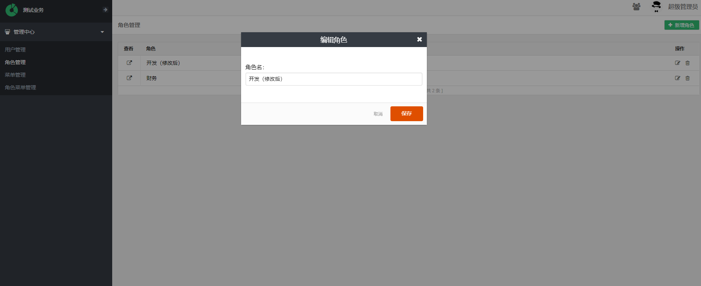
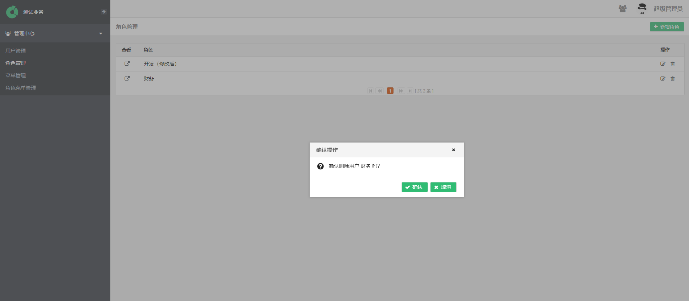
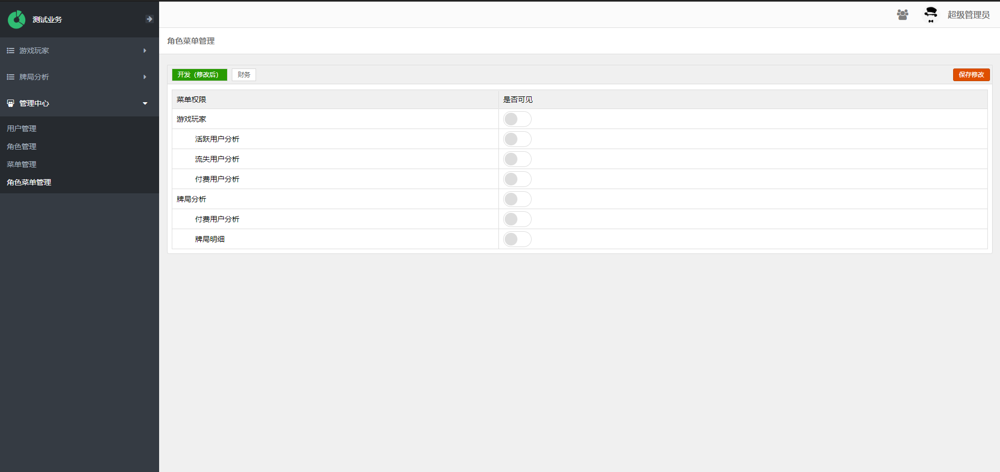
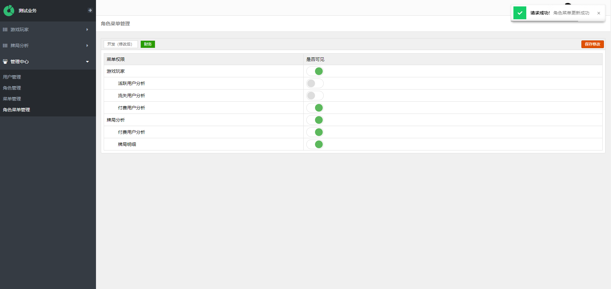

# 业务权限
对于业务的每一个数据都是敏感的，Seed系统做了针对页面的权限处理。每个有业务权限的用户都有不同的角色，每个角色关联了不同的页面。

## 业务用户管理

## 菜单管理
菜单管理是用来对自定义的数据报表页面进行配置。

可以通过管理中心-菜单管理 进入到配置页面。

点击页面右上角的 添加一级菜单 可以添加一个新的一级菜单， 在弹出来的对话框中填入菜单的名字，点击保存。

通过点击刚刚创建的 游戏玩家 的一级菜单对应右边的+ 创建二级菜单。

通过同样的步骤，可以创建出最终入下图的菜单列表。

**注意: 真的的保存需要点击右上方的 保存修改 按钮才是正在的保存成功**

## 角色管理
可以通过管理中心-角色管理 进入 角色管理页面。

### 新增角色
点击页面右上方的 新增角色 添加新的角色。

然后进入弹出角色命名对话框

点击保存，成功添加角色。

### 修改角色
点击对应角色右边的编辑按钮，弹出 编辑角色 对话框。

点击保存，成功修改角色

### 删除角色
点击对应角色右边的删除按钮即可。

## 角色菜单关联
之前介绍了角色 和 菜单 的管理，那么接下来则是将角色和菜单之间建立关联。

点击页面的管理中心-角色菜单管理进入 角色菜单管理页面。

点击上方的角色按钮，则可以跳转到对应角色关联的菜单页面，点击是否可见对应页面的按钮，则可以开启当前角色对应页面的查看权限。

修改财务角色对应的菜单页面查看角色如图。
**注意: 真的的保存需要点击右上方的 保存修改 按钮才是正在的保存成功**

## 备注
暂无