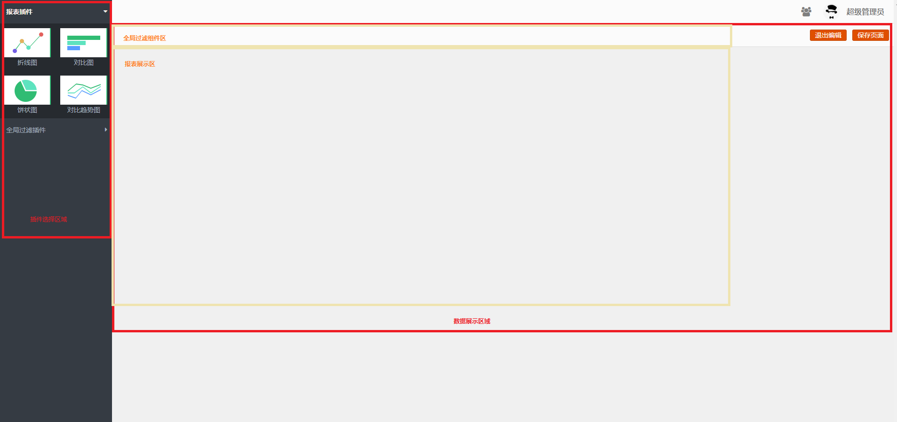
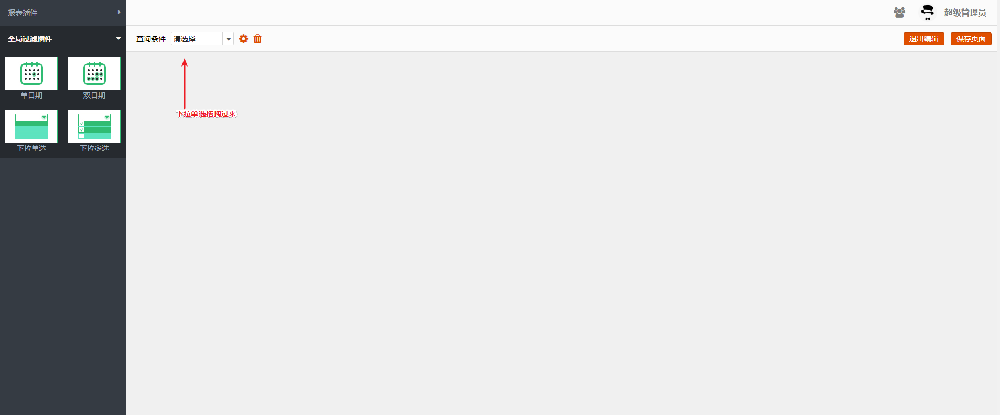
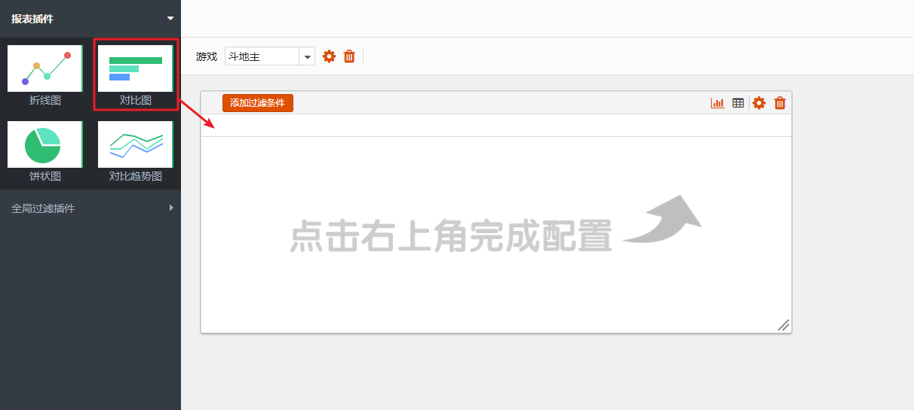

# 业务数据
数据报表是整个Seed系统最核心的部分，目前整个系统支持4种数据展示图表组件，4种数据过滤组件。

从逻辑来看，整个业务数据主要包括两部分图表编辑和图表查看。图表编辑主要使用人群为超级管理员和业务管理员，图表查看主要为普通用户。

## 图表编辑
图表编辑主要以拖拽，选择和输入为主。图表编辑可以通过每个页面的右上方的 编辑页面进入。

点击进入之后，主要可以看到 分为两个区域的 插件选择区域 和 右边的数据展示区域。其中数据展示区域又分为 全局过滤插件区 和 报表展示区。具体如下图所示

整个页面的交互逻辑是 从左边的 插件选择区域 将需要的插件通过拖拽的方式 拖拽到对应的位置。然后页面会立马显示出来，然后点击对应插件的配置按钮通过配置界面对插件进行配置。

可以从插件选择区域看出，所有插件分成两类，一个是全局过滤插件 和 报表插件。其中报表插件在配置的过程中还可以配置局部的过滤插件。下面将从这三个方面进行介绍。

### 全局过滤插件
过滤插件顾名思义是用来过滤数据的，可以从全局的过滤插件中看到，当前支持单日期，双日期，多选，单选四种类型的过滤组件。从SQL的角度出发，过滤插件就是组装在where条件下，然后通过筛选过滤插件，动态的更新SQL的where条件获取不同的数据。
如何配置
那么全局过滤插件，则是说当前这个插件的过滤条件适用于当前页面的 报表插件 和 过滤插件。 在报表插件中可以用来过滤展示的数据，在过滤插件用可以用来做数据筛选的级联。

#### 如何配置
从全局过滤插件中选择一种过滤插件拖拽到数据展示区域的全局过滤插件区域。如下图

#### 如何编辑
点击对应过滤组件的编辑按钮，弹出组件编辑页面， 如下图所示。

可以从上图的配置页面可以看到，需要配置 中文名称，这是当前组件在整个页面的唯一标识，数据库字段则是当前过滤组件在其他图表插件中的数据库字段。 数据源有两种方式，一个是手动配置， 另一个是SQL配置。

这里选择了SQL配置，选择SQL配置需要选择数据从哪个数据库来，数据库查询的SQL。

#### 保存成功
在配置完之后，点击保存，则会立刻去后台拉取数据，具体如下图。

### 报表插件
报表插件是用来展示数据的，当前支持折线图，对比图，饼状图和对比趋势图四种图表展示插件。

#### 如何配置
从报表插件中选择一种报表插件拖拽到数据展示区域的报表展示区。

#### 如何编辑
点击对应报表插件的编辑按钮，弹出插件编辑页面，如下图所示。

报表名称和报表描述是对当前报表的功能进行说明和标记。
数据源则是指定当前报表的SQL从哪个数据库取数。
SQL配置则是输入取数的SQL。

其中在SQL配置下面有个 游戏 的标签，这就是之前配置的全局过滤组件的标签。将光标放置到where 后面，点击游戏这个标签，则会自动生成game_id={game_id}, 其中{}中的内容不可以改变，其他部分都可以根据SQL适当更改。

SQL配置好之后，点击生成指标和维度。
下面会自动生成数据项，对数据项进行配置中文名，是指标还是维度类型，还有其他必要的配置。

#### 保存成功
在配置完成之后，点击保存，则会立刻从后台拉取数据，具体体现下图。

其中可以通过选择不同的游戏来进行过滤图表中的，如下图所示

